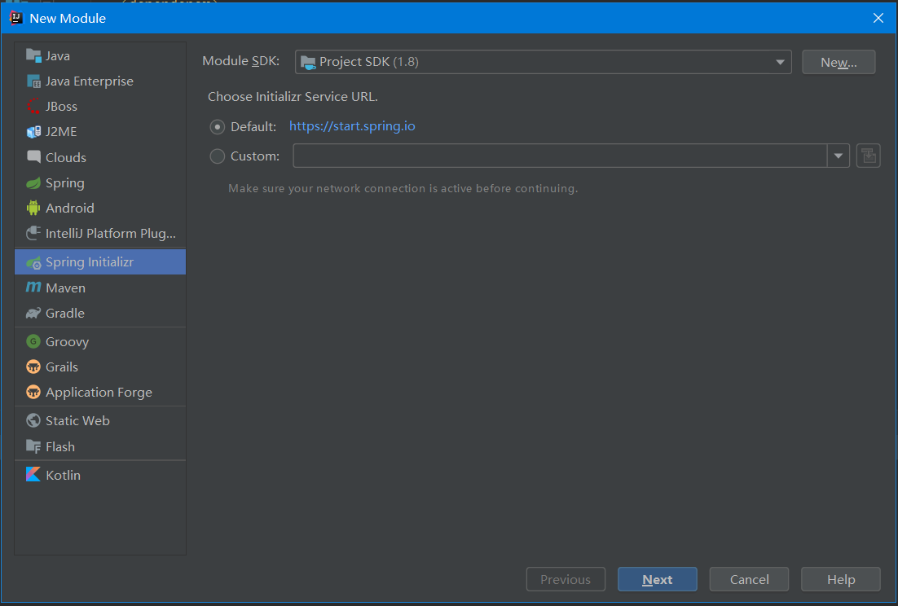
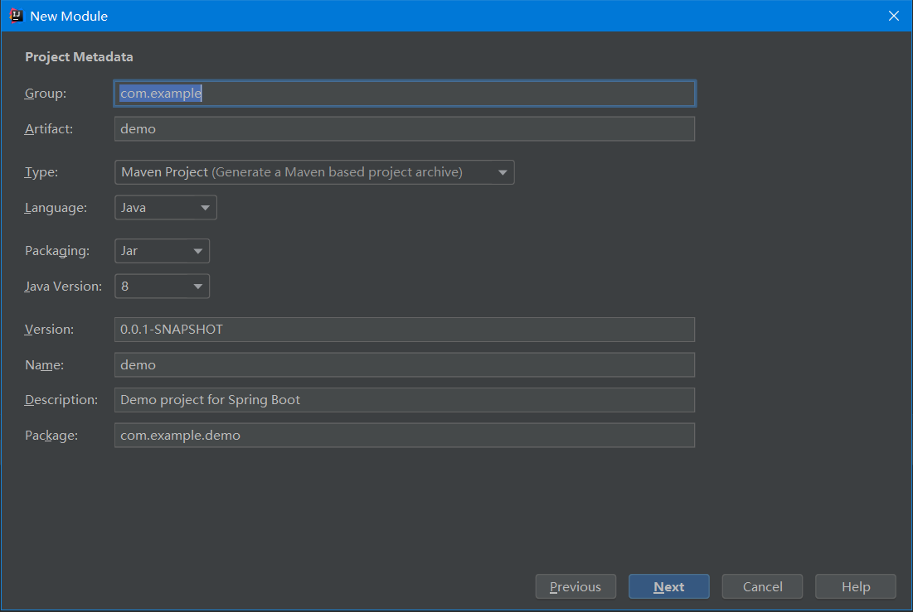
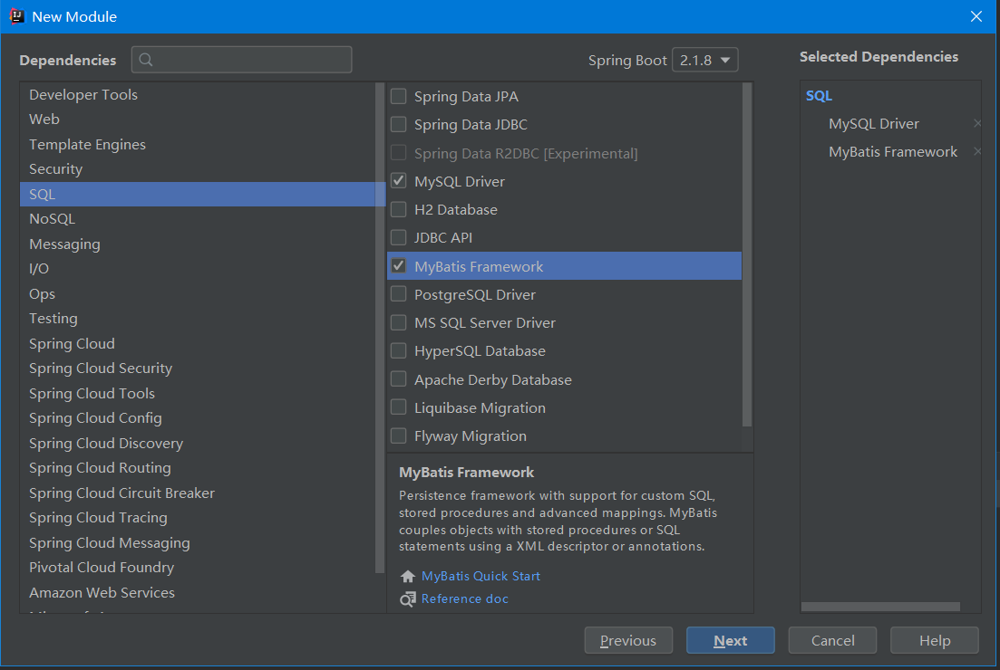

# pigeon 搭建总结1-初步搭建

## 1、概述

​	基于spring boot2，pigeon是repeater下的一个项目，主要侧重于博客发布功能，目前repeater下只有这一个项目。

## 2、准备工作

> 基本的准备工作，其他插件或框架在后续用到时描述

* 环境：idea、java8、mysql5.5+、postman
* idea需要加载maven、database、spring的插件支持

## 3、搭建简单的spring boot 工程

### 	3.1、使用脚手架生成基本框架


 * #1 new ->spring initalizr -> default URL :https://start.spring.io/ -> next
   

 * #2  type : Maven Project -> next
   

 * #3  web: Spring  Web 、；SQL : MySQL Deiver、Mybatis Framework
   

   
### 	3.2、组织包结构

> 3.2独立出来没有与3.3结合的原因是想记录开发过程中伴随着包结构调整所表现的架构调整

* 原始包结构

  ```
  demo
  │	HELP.md
  │   pom.xml
  │
  └───src
  │   └───mian
  │   │   └───java
  │   │	│	└───com.example.demo
  │   │	│	│ 	DemoApplication.java
  │   │	│	|
  │   │   └───resource
  │   │	│ 	application.properties
  │   │	│ 
  │   │	│	└─── static
  │   │	│	└─── templates
  │   └───test
  │   │   └───java
  │   │	│	└───com.example.demo
  │   │	│	│ 	DemoApplication.java
  ```

* 更改配置文件 application.properties - >application.yaml

* 在com.example.demo新建包controller、service、model、dao，

* 在resource下新建mapper文件夹

* 整理后包结构

  ```
  demo
  |...
  │   │   └───java
  │   │	│	└───com.example.demo
  │   │   │	│	└───controller
  │   │   │	│	└───service
  │   │   │	│	└───dao
  │   │   │	│	└───model
  │   │	│	│ 	DemoApplication.java
  │   │	│	|
  │   │   └───resource
  │   │	│ 	application.yaml
  │   │	│ 
  │   │	│	└─── mapper
  │   │	│	└─── static
  │   │	│	└─── templates
  ```

  

### 3.3 组织工程

* spring boot配置文件

  > application.yaml,
  >
  > 注意:mysql链接驱动最新版需要加时区配置  **serverTimezone=GMT**

  ```yaml
  server:
    port: 8082
  spring:
    datasource:
      url: jdbc:mysql://localhost:3306/demo?serverTimezone=GMT&useUnicode=true&characterEncoding=utf-8&useSSL=true
      username: root
      password: root
      driver-class-name: com.mysql.jdbc.Driver
  mybatis:
    mapper-locations: classpath:mapper/*.xml
    type-aliases-package: com.example.demo.model
    configuration:
      map-underscore-to-camel-case: true
  ```

  

* 传输对象

  > 统一返回对象BaseResultDto；普通实体对象BaseEntity

  ```java
  public class BaseResultDto {
   
      private int code;   //结果编码
      private String msg;    //描述
      private Object data;   //返回对象
      
      //通用方法
      public static BaseResultDto Ok(Object obj){
          return new BaseResultDto(200,"操作成功",obj);
      }
  
      public static BaseResultDto errorException(Exception ex){
          return new BaseResultDto(0,ex.getMessage(),"");
      }
  
      //========Constructor 省略。。。==========//
  
      //========getter / setter 省略。。。==========//
  
  }
  ```

  

* controller层

* service层

* dao层

​	

​	

## 4、引入lombok

## 5、引入tk-mybatis，实现Dao通用

## 6、实现control和service通用

## 7、总结